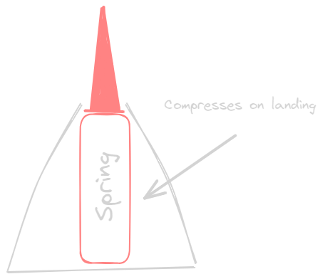

# S.M.O.R.T. abstract
The goal of this project is to create a launch system for a rocket of our design were we can target the rocket to land in a predetermined area. Using a rasbery pi to collect information and adjust our drag calculation.

## Rocket Design
The rocket is designed to be modular and easy to print as to enable us to iterate as fast as possible. Each part being modular will allow us to fix problems easily and for example change the rocket motor or even alter the mode of propulsuon all together.

### Launch System
The launch system has several possible designs. The main mode used right now is a rocket and all designs revolve around that system. The diffrent ideas of launch systems are as follows:

- external 9v to power an interal launcher 

- Heated resisistor to ignite rocket motor
- primers

### Body
The body isnt really compicated it just contains all of the electronics and potentialy fins. It should eaither be threaded or use a pin to connect to the nose cone 

## Nose Cone
The nose cone is a part that will be deisgned to absorbe all of the shock it will contain a spring and a pin that will absorbe the brunt of the landing shock. (it will not be filled with any explosive compound). 

 

## Targeting System
The targeting system will just control the angle of the launch tube relative to the ground eaither using a threaded rod or other method. If the project completes early you can also add a rotation system to the rocket to control the direction of the rocket.

## Risk Mitigation
### Concerns
The rocket might accidentally interference with humans during a launch.
Shorting electronics.

### Mitigations
LAUNCH STEPS
* Step 1) Safety glasses
* Step 2) Run

---
* The rocket stand is also engineered to have a max angle of 75 degrees to ensure the rocket will not fire straight up, considering we do not have a parachute that will deploy.
* Organize a meeting to talk about more risk mitigation procedures before launch.
* discuss more safety  issues as they come up

# Schedule

## End of January 
- [ ] Finish the rocket design
- [ ] First Shell printed 
- [ ] Interal Wiring prototype done.
- [ ] Rocket code done (just data collection)

## Mid February
- [ ] First Launch without lanucher to collect data 
- [ ] Final Rocket design done
- [ ] beginig of lanucher iteration and code
- [ ] 

## End of February
- [ ] First Launch with lanucher
- [ ] Fix issues with rocket
- [ ] rocket to work issueless and consistently

## May 
- [ ] Accurate targeting system
- [ ] Final Launch
- [ ] finish documentation

# Materials 

## Shell
- Nose cone
- Impact Spring
- Stabilization fins
- Ignition Pins
- Ignighter
- 2 Picos and other onboard electronics
- Rocket motor (A,B,C)

## Tube + Targeting 

- 4in/101.6mm PVC pipe
- Pipe end cap
- Blast Plate/Rotation Plate (1m x 1m minimum size)
- rotation motor (stepper)
- rotation bearing
- rotation gears
- Angle legs (metal/wood a frame)
- Angle motor (stepper 1 or 2)
- Angle gears

## Launcher

- 12 Volt battery
- Conductor plates
- Saftey Switch
-
-
-

# Code blocks

---

