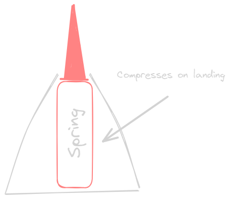

# Dump

## seperation

- Seperate the rocket into diffrent parts 
    - The nose cone
    - The body
    - The fins
    - The rocketHolder/Engine\

- Use threaded rods to connect the parts
- Thread the individual parts together such as [Grams and malik rocket](https://github.com/mpascha61/Pi-in-the-Sky)

The idea is to make iteration easier that every part can be changed and tested seperatly and then put together to make the final rocket although this does create complexity and **integration hell.** 

## Nose cone
Could use a spike to hinder the 
 

## Body
- "Rifle" the sides of the body to make it spin and stabalize the rocket

## Fins 
- Deployable fins
- Ring with fins inside of it 

## RocketHolder/Engine

---
# Reasorces
